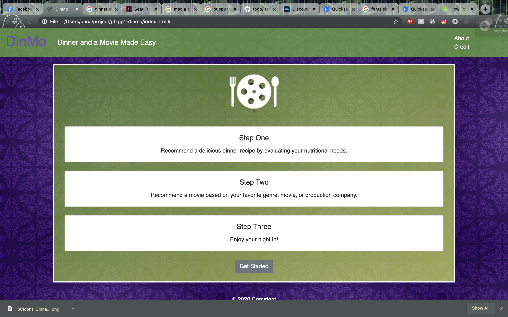

# Dinner and a movie application
By: Chay, Christina, Austin, Anna  
<i>These are the terms of installation for this code.<i>

## Description
<i>This website is for those looking to enjoy their eveing with their significant other, or even just themselves. An evening of a good movie and some dinner is always rejuvinating before going back to work the next day. It is a great way to relax. With this application it is possible to go into a database full of good suggestions and set up your eveing the right way. First, pick the food that you want. You can choose the protein, veggie, and even whether or not you have any dietary restrictions. Next, go to the movies sections where you have the ability to choose the genre, a favorite movie from that genre, and also your favorite production company that that your search results are based off of your personal preferences. Please enjoy!<i>

## Table of Contents
### 1. Description  
### 2. User Story  
### 3. Credit  
### 4. API Sources  
### 5. Usage  
### 6. License  

## User Story
<i>
As a person in need of relaxation,  
I want to find customized recipes and movies based on my preference, 
So that I can spend quality time by myself or with loved ones rather than searching through meal and movie options.
<i>

## Credit
<i>
"This product uses the TMDb API but is not endorsed or certified by TMDb."
<i>

## API Sources
<i>
link to developer page: https://developers.themoviedb.org/
<i>

## Usage
<i>

link: https://chayvw.github.io/gt-gp1-dinmo/

## Screenshot

<i>

## Licensing
<i>
MIT License

Copyright (c) [2020] [Chay, Phuong, Christina, Austin]

Permission is hereby granted, free of charge, to any person obtaining a copy
of this software and associated documentation files (the "Software"), to deal
in the Software without restriction, including without limitation the rights
to use, copy, modify, merge, publish, distribute, sublicense, and/or sell
copies of the Software, and to permit persons to whom the Software is
furnished to do so, subject to the following conditions:

The above copyright notice and this permission notice shall be included in all
copies or substantial portions of the Software.

THE SOFTWARE IS PROVIDED "AS IS", WITHOUT WARRANTY OF ANY KIND, EXPRESS OR
IMPLIED, INCLUDING BUT NOT LIMITED TO THE WARRANTIES OF MERCHANTABILITY,
FITNESS FOR A PARTICULAR PURPOSE AND NONINFRINGEMENT. IN NO EVENT SHALL THE
AUTHORS OR COPYRIGHT HOLDERS BE LIABLE FOR ANY CLAIM, DAMAGES OR OTHER
LIABILITY, WHETHER IN AN ACTION OF CONTRACT, TORT OR OTHERWISE, ARISING FROM,
OUT OF OR IN CONNECTION WITH THE SOFTWARE OR THE USE OR OTHER DEALINGS IN THE
SOFTWARE.<i>

